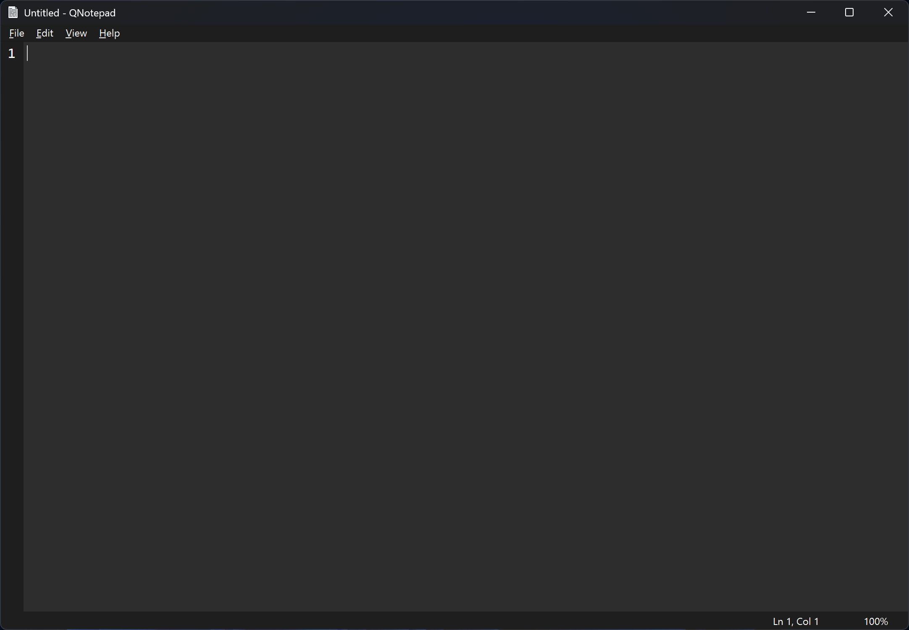
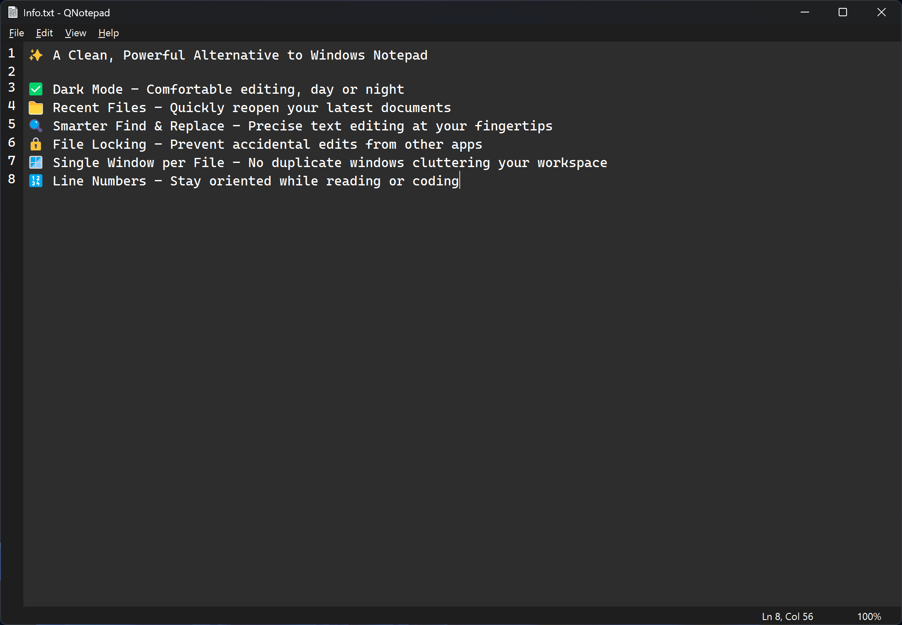
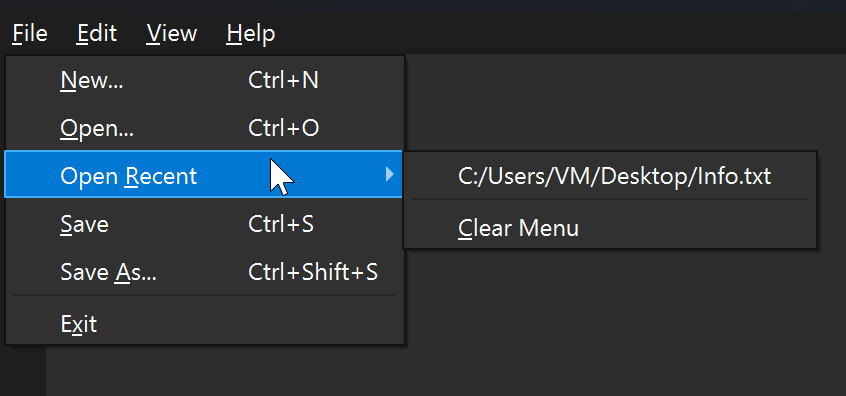
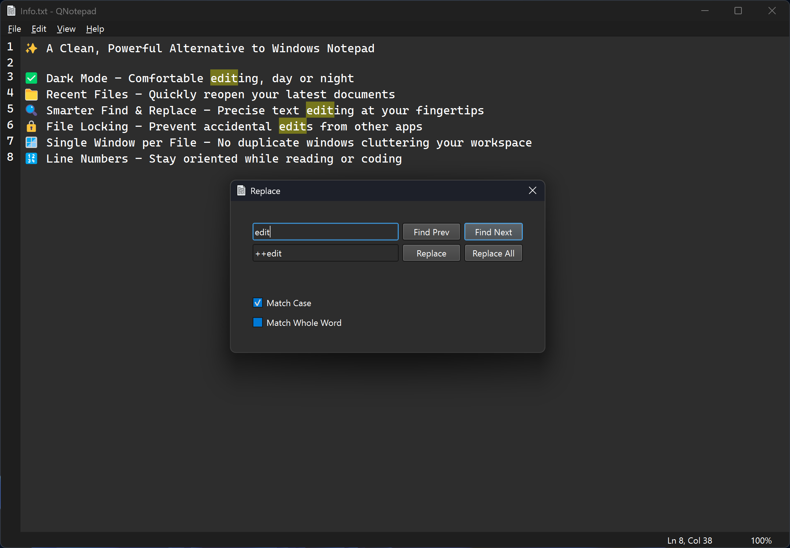
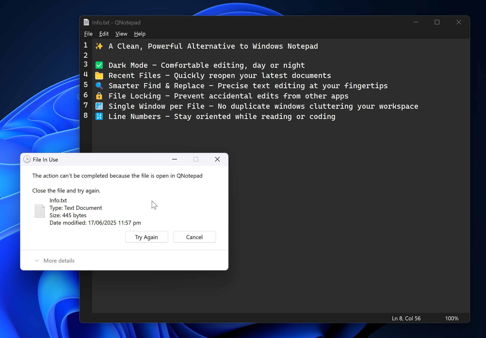
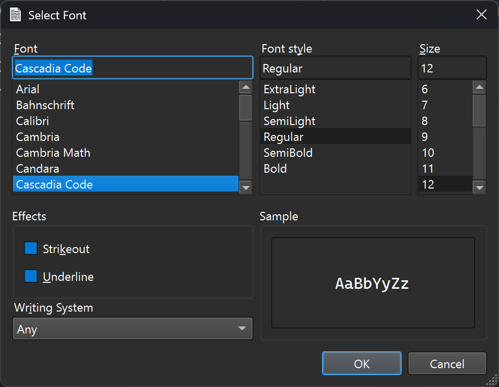
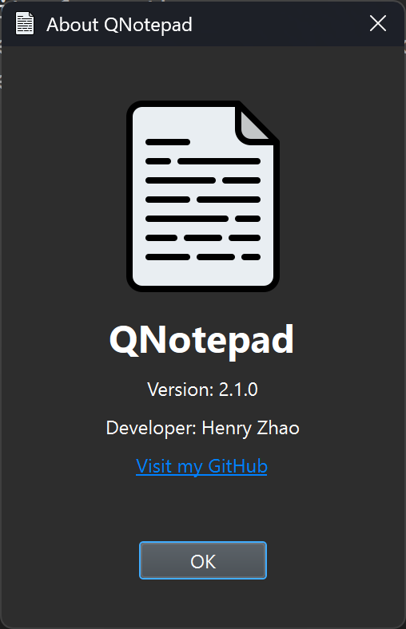

# QNotepad

✨ A Clean, Powerful Alternative to Windows Notepad

✅ Dark Mode – Comfortable editing, day or night

📁 Recent Files – Quickly reopen your latest documents

🔍 Smarter Find & Replace – Precise text editing at your fingertips

🔒 File Locking – Prevent accidental edits from other apps

🪟 Single Window per File – No duplicate windows cluttering your workspace

🔢 Line Numbers – Stay oriented while reading or coding

# Preview

Initial Launch:

Editing File:

Open Recent File:

Find/Replace Text:

Lock File in Use:

Customize Font:

About Dialog:

